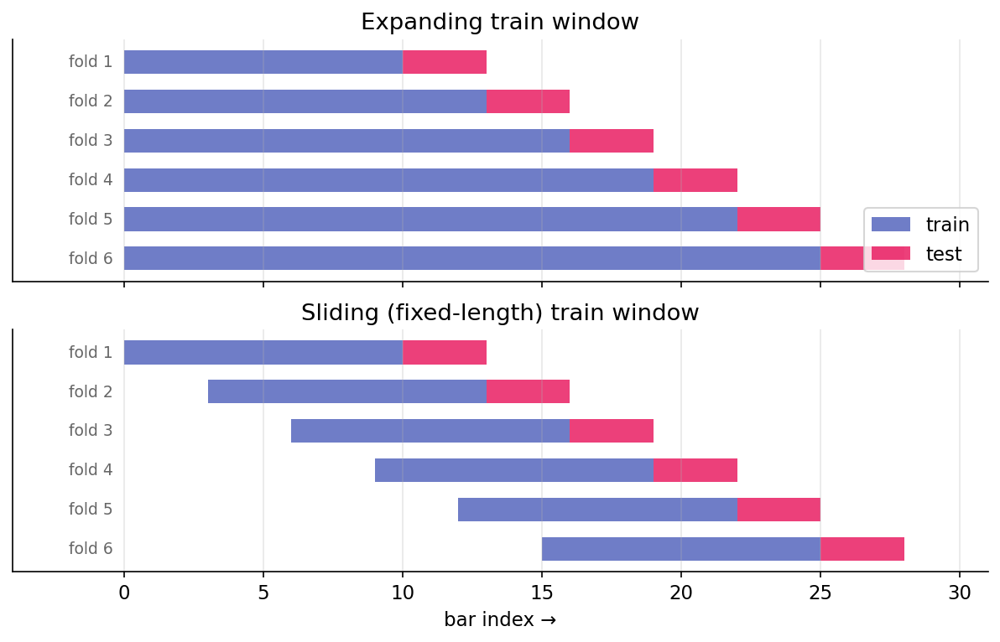

# Walk-forward vs k-fold

A backtest answers a counterfactual: if this strategy had been deployed at time $t$, knowing only what was available then, how would it have performed? The standard tool for answering such questions is cross-validation. The default machine-learning approach — random k-fold — silently fails on time series. Walk-forward is the correction.

## Why naive k-fold is inappropriate

Standard k-fold cross-validation shuffles the dataset, splits into $k$ folds, trains on $k - 1$ folds, and tests on the held-out fold. The procedure assumes independently and identically distributed (iid) data, so the held-out fold represents a fair sample from the same distribution as training.

Financial time series are not iid, and k-fold fails in two ways:

1. **Temporal leakage.** Shuffled k-fold places training data from after the test fold's wall-clock time into the training set. A model trained in this configuration has access to future information, and the realized test performance reflects knowledge unavailable at prediction time.

2. **Regime mixing.** Markets alternate between regimes (low volatility, high volatility, trending, mean-reverting). Randomly sampling across regimes in both training and test folds causes the model to learn a regime-average rather than a regime-specific response. The test statistic then overstates robustness in any particular regime encountered live.

These effects are not minor. A k-fold Sharpe on a trading strategy can be twice the live-trading Sharpe on the same signal, driven entirely by temporal leakage that appears as out-of-sample evidence.

## Walk-forward procedure

Walk-forward respects time order. At each step:

1. Train on data from the start through time $t$ (or from $t - \text{window}$ through $t$ with a fixed-length train window).
2. Test on data from $t$ to $t + h$ (the horizon).
3. Advance $t$ by a stride and repeat.

Pictorially, with `initial_train = 10`, `test_horizon = 3`, `stride = 3`, comparing the two train-window variants:

{ loading=lazy }

Every test fold is strictly after its training fold in wall-clock time. No temporal leakage occurs. Each test observation answers: what would this model have said about this period given only what was available before it?

## Expanding versus sliding train windows

Two common variations:

- **Expanding**: the train window grows with each step, using everything up to $t$. More data over time generally produces more stable estimates, but old regimes accumulate weight in the training data.
- **Sliding** (rolling): the train window has fixed length $W$, so training data is always $[t - W, t]$. This is adaptive to regime changes — old data ages out — but uses less data at any given step.

The choice depends on the strategy. For a strategy whose edge is stationary across regimes, expanding is preferred (more data is typically better). For a strategy whose edge is regime-dependent, sliding is preferred (forgetting old regimes allows adaptation). When unclear, running both and reporting both is appropriate.

The harness's `WalkForwardConfig` has an `expanding` boolean (default `True`). Setting it to `False` produces the sliding variant with train length equal to `initial_train`.

## Stride and overlap

The **stride** controls how far the anchor advances between folds. Stride equal to test horizon ($s = h$) produces non-overlapping test folds — the simplest and most defensible choice. Stride less than horizon ($s < h$) produces overlapping test folds, each using new data plus previously-seen data. Stride greater than horizon ($s > h$) leaves gaps in coverage.

For most backtests, $s = h$ is appropriate. Overlapping test folds appear to provide more observations but do not yield independent ones — they re-measure similar signals with small perturbations.

## Walk-forward as the outer loop

Walk-forward is the outer evaluation loop. Inside each fold, model selection — hyperparameter choice, feature selection, threshold calibration — may require its own cross-validation. This inner CV is a separate design choice with its own leakage considerations ([next lesson on purging](purging-embargo.md)).

A standard protocol:

1. Walk-forward defines the outer train-test splits.
2. Within each outer train set, purged k-fold selects hyperparameters on held-out purged folds.
3. Retrain on the full outer train set using the selected hyperparameters.
4. Evaluate on the outer test fold.
5. Advance the walk-forward anchor.

Violating this structure — for example, using the outer test fold to select hyperparameters — introduces subtle look-ahead bias that will not survive in live trading.

## What walk-forward does not prevent

Walk-forward catches temporal leakage but leaves other forms of bias unaddressed:

- **Label-horizon leakage.** A training label at time $t$ that depends on prices through $t + 5$ can overlap the test fold even when $t$ itself is in the train set. Purging ([next lesson](purging-embargo.md)) is the correction.
- **Data-snooping bias.** Walk-forward evaluates a single strategy. If 100 strategies were tried and this one selected, the test performance is biased upward by selection. Walk-forward does not account for the number of trials. [Deflated Sharpe](deflated-sharpe.md) provides the downstream correction.
- **Forward-looking features.** Features computed from future data (forward-looking corporate action adjustments, certain index methodology data) leak regardless of cross-validation scheme. Features must be audited against: what was available at $t$?
- **Survivorship bias.** Running a backtest on today's index constituents (rather than the historical constituents at each date) silently excludes companies that went bust. Backtests on surviving names overstate performance.

Walk-forward is necessary but not sufficient. It catches the most common leakage (temporal) but not the subtler forms.

## Expanding-train estimator noise

Expanding-train walk-forward produces small training sets in early folds. Fold 1 may have 252 observations; fold 20 may have 1,512. Early-fold model quality is worse not because the strategy has no edge, but because the estimator is noisy on small samples.

This biases the cumulative out-of-sample Sharpe downward in early folds. As the training set grows, the bias diminishes, so realized backtest performance improves over time even when the underlying edge is stationary. This pattern should not be interpreted as a strengthening edge — it is an artifact of decreasing estimator noise.

The `initial_train` parameter sets the first training window's size and should be large enough that fold 1's model produces reasonable out-of-sample behavior. For daily bars, 252 (one year) is a typical minimum; 504 is more conservative.

## Summary

The reader can now reason about:

- Why random k-fold cross-validation produces optimistic Sharpes on time series: shuffling grants training data access to the future.
- The distinction between expanding and sliding train windows, and the conditions under which each is appropriate (stationary edge versus regime-dependent edge).
- Why walk-forward is necessary but not sufficient: it catches temporal leakage but not survivorship bias, data snooping, or forward-looking features.

## Implemented at

`trading/packages/harness/src/harness/backtest.py`:

- Line 22: `WalkForwardConfig(initial_train, test_horizon, stride, expanding=True)`.
- Line 40: `WalkForward.split(n_samples)` — generator that yields `(train_idx, test_idx)` pairs.

The module docstring notes explicitly: `WalkForward does NOT execute the strategy — it yields index pairs. The caller trains, predicts, and computes PnL per window`. This separation is deliberate; it keeps the harness agnostic to model type, feature construction, and cost modeling.

---

**Next:** [Purging, embargo, and label horizons →](purging-embargo.md)
