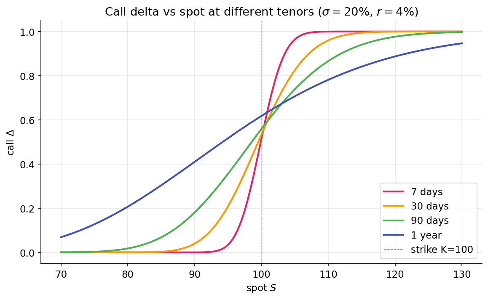

# Delta — sensitivity to price

The Black-Scholes derivation produced a hedging portfolio $\Pi = C - \Delta S$ whose first-order risk cancels. The coefficient $\Delta$ — the partial derivative of option value with respect to the underlying — simultaneously describes exposure, hedge ratio, and an approximate probability of exercise.

## Definition

$$
\Delta = \frac{\partial V}{\partial S}.
$$

Delta is the dollar change in an option's value per $1 change in the underlying. It is a rate evaluated at a specific $S$, valid for small moves. For a European call under Black-Scholes:

$$
\Delta_\text{call} = N(d_1),
$$

so $\Delta \in (0, 1)$. For a European put, by put-call parity:

$$
\Delta_\text{put} = N(d_1) - 1 = -N(-d_1),
$$

so $\Delta \in (-1, 0)$.

A call's price rises with the underlying, so its delta is positive. A put's price falls with the underlying, so its delta is negative. The magnitudes indicate how closely each option's value tracks the underlying.

## Three regimes

### Deep ITM: $\Delta \to \pm 1$

When a call's strike is well below the current spot and expiry is near, the option is nearly certain to finish ITM. Its value at expiry equals $S_T - K$, which moves dollar-for-dollar with $S_T$, so $\partial V / \partial S$ approaches 1. A deep-ITM call behaves like stock net of a fixed obligation. Put-call parity confirms this algebraically: $C = P + S - Ke^{-rT}$; when $P$ is small (as in deep-ITM calls, which correspond to deep-OTM puts), $\partial C / \partial S \approx 1$.

For a deep-ITM put, $\Delta \to -1$, with the position moving inversely to stock.

### Deep OTM: $\Delta \to 0$

When a call is far out of the money and near expiry, small moves in $S$ have little effect on the probability of finishing ITM. The option value is dominated by the small time value of a low-probability event, and $\partial V / \partial S$ approaches zero.

### ATM: $\Delta \approx 0.5$ for a call, slightly above

When $S = K$ and sufficient time remains, the call has approximately a 50% risk-neutral probability of finishing ITM (via $N(d_2)$), and delta is approximately 0.5 — though not exactly. For a call with positive time to expiry and non-zero volatility, $d_1 > d_2$, so $N(d_1) > N(d_2)$. An ATM call's delta is typically in the 0.52–0.55 range. The offset reflects the asymmetry of upside versus downside payoffs: unbounded upside, bounded loss equal to the premium.

Across a range of spot values at several tenors, the three regimes form a single smooth S-curve whose slope at the strike sharpens as expiry shortens (7-day has the steepest transition; 1-year is diffuse):

{ loading=lazy }

## Delta as hedge ratio

The Black-Scholes derivation produces this directly: the portfolio $\Pi = C - \Delta S$ is locally riskless. A long call's exposure to the underlying equals that of $\Delta$ long shares; shorting $\Delta$ shares therefore neutralizes the first-order exposure.

Example: a position of 10 SPY calls with strike $\$450$ and 30 days to expiry, with SPY at $\$450$. Each contract covers 100 shares (the standard U.S. equity option multiplier). The call delta is 0.53 at these parameters.

- **Position delta:** $10 \text{ contracts} \times 100 \text{ shares/contract} \times 0.53 = 530$ share-equivalents.
- **Delta hedge:** short 530 shares of SPY.
- **Net position:** approximately delta-neutral — portfolio P&L is near zero for small moves in SPY.

The term "delta-neutral" describes first-order neutrality, not overall profit neutrality. Second-order sensitivity (gamma, covered in the next lesson) remains, and theta (time decay) erodes value over time. The purpose of delta hedging is to isolate these second-order effects so they can be traded independently of directional exposure. Shorting shares against a long call removes directional exposure; what remains is a volatility position.

## Delta as approximate probability

Traders often describe delta as the probability of finishing ITM. This is approximate. From the Black-Scholes formula:

$$
\Delta_\text{call} = N(d_1), \qquad \mathbb{P}(S_T > K \mid \text{risk-neutral}) = N(d_2), \qquad d_1 - d_2 = \sigma \sqrt{T}.
$$

$\Delta$ equals the probability only in the limit of zero volatility or zero time. For a 30-day option with $\sigma = 20\%$, $\sigma \sqrt{T} \approx 0.058$, and the gap between $N(d_1)$ and $N(d_2)$ is small. For LEAPS (multi-year expiry), $\sigma\sqrt{T}$ can exceed 0.4, and delta can overstate the exercise probability by several percentage points.

The "30-delta = 30% probability of ITM" shorthand is accurate enough for short-dated contracts. For long-dated positions, the distinction matters.

## Delta-one products

Instruments that move one-for-one with the underlying have $\Delta = 1$. The underlying itself satisfies this trivially. Futures approximately do (subject to cost-of-carry adjustments); ETFs tracking the underlying do, within tracking error. "Delta-one" desks at banks trade these products: baskets and swaps whose risk profile is purely directional, with no convexity.

A covered call position (long 100 shares + short 1 call) has net delta $1 - \Delta_\text{call}$: the long stock contributes $+1$ per share (so $+100$ on 100 shares), and the short call contributes $-100 \times \Delta_\text{call}$. The net is $100(1 - \Delta_\text{call})$ share-equivalents, producing reduced upside exposure with fully retained downside until the call expires.

## Delta is not constant

The remainder of Part 3 follows from one observation: delta is a function of $S$, $t$, and $\sigma$. As the underlying moves, delta changes. As time passes, delta changes even at fixed $S$. As volatility moves, delta changes. Each of these sensitivities is itself a Greek:

- $\partial \Delta / \partial S = \Gamma$ — [next lesson](gamma.md), the primary second-order sensitivity.
- $\partial \Delta / \partial t$ — charm; small but non-zero, material on expiry Fridays.
- $\partial \Delta / \partial \sigma$ — vanna; couples delta to volatility shifts and matters when the vol surface reshapes.

A delta hedge correct at $t_0$ is no longer correct at $t_0 + dt$. Market makers consequently rebalance continuously (in theory) or frequently (in practice). The accumulated P&L of a delta-hedged position is not zero: it depends on realized versus implied volatility — the subject of the next lesson.

## Summary

The reader can now reason about:

- Why deep-ITM calls move like stock and deep-OTM calls are nearly insensitive to small changes — delta varies smoothly from 0 to 1.
- How a market maker neutralizes directional risk on a quoted call using a single number.
- Why "delta ≈ probability of ITM" works as shorthand for short-dated options but breaks for long-dated ones as the $\sigma\sqrt{T}$ gap between $N(d_1)$ and $N(d_2)$ widens.

## Implemented at

`trading/packages/gex/src/gex/greeks.py:52` — `bs_delta_call(spot, strike, rate, sigma, tenor_years)` returns $N(d_1)$, vectorized over strikes and volatilities. It is used in the 25-delta skew computation ([Part 4](../vol-surface/skew.md)): given a target delta such as $0.25$, the skew module finds the strike whose call has that delta and reads the IV at that strike. This delta-to-strike inversion is the primary consumer of `bs_delta_call`.

---

**Next:** [Gamma — the second derivative →](gamma.md)
