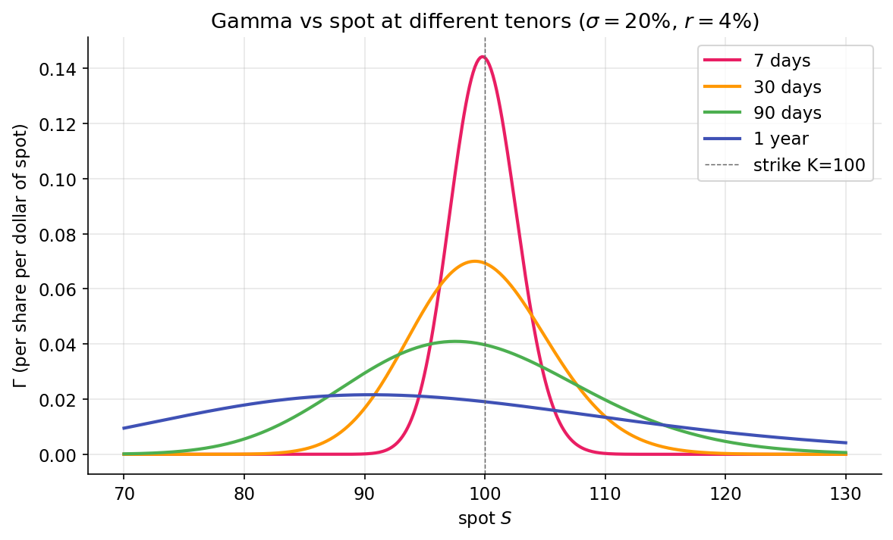

# Gamma — the second derivative

Delta is the option's exposure to the underlying. Gamma is delta's exposure to the underlying. Two facts emerge from that nesting: the hedge you set at $t$ is stale by $t + dt$, and the rate at which it goes stale is itself a tradable quantity. Everything about dealer positioning and market regimes in Part 5 flows from gamma.

## The definition

$$
\Gamma = \frac{\partial \Delta}{\partial S} = \frac{\partial^2 V}{\partial S^2}.
$$

Gamma measures how much delta changes per $1 move in the underlying. It is always non-negative for long options (calls and puts alike) — the payoff is convex in $S$, and the second derivative of a convex function is non-negative.

Under Black-Scholes:

$$
\Gamma = \frac{\phi(d_1)}{S \sigma \sqrt{T}},
$$

where $\phi$ is the standard normal PDF. Notice: gamma is **the same for a call and a put of the same strike and expiry**. The call and put deltas differ by 1 (put-call parity), but their derivatives with respect to $S$ are identical. This is why the GEX pipeline uses one `bs_gamma` function regardless of whether a contract is a call or a put.

## When gamma is large, and when it isn't

Three drivers:

1. **Moneyness.** $\phi(d_1)$ is the standard normal density at $d_1$. It peaks when $d_1 = 0$, which is approximately when $S = K$ (for short-dated options with modest rates). **ATM options have the highest gamma.** Deep ITM or deep OTM options have low gamma — delta is already near 1 or 0 and doesn't change much with $S$.

2. **Time to expiry.** The $\sqrt{T}$ in the denominator means **gamma explodes as expiry approaches** for ATM options. A 30-day ATM call has moderate gamma; a 1-day ATM call has enormous gamma. Delta whipsaws between near-0 and near-1 as the underlying crosses the strike on expiry day. This is the setup for the "pin risk" around expiration.

3. **Volatility.** The $\sigma$ in the denominator means gamma is higher when implied vol is lower. Counterintuitive at first — but think about it this way: when $\sigma$ is high, $d_1$ is far from zero for a wider range of $S$, and $\phi(d_1)$ is small; when $\sigma$ is low, small moves in $S$ cross $d_1 = 0$ sharply, and gamma concentrates there.

{ loading=lazy }

The ~7× ratio between the 7-day and 1-year peaks at ATM is exactly the $1/\sqrt{T}$ scaling made visual: $\sqrt{365/7} \approx 7.2$, which matches the plotted peak heights.

## P&L of a delta-hedged position

This is the punchline of Part 3. Take a position long one call, hedged short $\Delta$ shares. Over a small time $dt$ during which the underlying moves by $dS$, the portfolio P&L is:

$$
d\Pi \approx \underbrace{\Theta\, dt}_{\text{time decay, negative}} \;+\; \underbrace{\tfrac{1}{2} \Gamma\, (dS)^2}_{\text{gamma, always positive}}.
$$

Where did the delta terms go? Cancelled — that's what the hedge does. First-order moves in $S$ in the call are offset by first-order moves in $-\Delta S$. What remains is second-order in the underlying (gamma) and first-order in time (theta).

Two things to notice:

- **Gamma P&L is always non-negative.** $(dS)^2$ is non-negative, and $\Gamma$ is non-negative. Every price move — up or down — contributes a positive increment to the hedged position.
- **Theta P&L is always non-positive for long options.** Time decay erodes the position whether or not the underlying moves.

The hedged option holder makes money from volatility (however realized) and loses money from the passage of time. These compete. The break-even condition has a clean form:

$$
\tfrac{1}{2} \Gamma\, (dS)^2 = -\Theta\, dt \quad\Longrightarrow\quad \left(\frac{dS}{S}\right)^2 \approx \sigma_\text{implied}^2\, dt.
$$

That is: a long, delta-hedged position breaks even exactly when realized squared return equals implied variance per unit time. **The option's implied vol is the vol at which the hedged position has zero expected P&L**. If realized > implied, long gamma profits. If realized < implied, long gamma loses.

This is the single most important relationship in options trading. It reframes "option price" as "the market's forecast of realized vol such that a hedged position breaks even." Vol traders think in these units exclusively.

## Gamma scalping

A long-vol position, hedged regularly, makes money by buying low and selling high — mechanically. Here's why:

- At $S_0$, you hold long 1 call with delta $\Delta_0$. You short $\Delta_0$ shares.
- Stock moves up to $S_1$. The call's delta is now $\Delta_1 > \Delta_0$ (because gamma). Your portfolio is **under-hedged** — you're implicitly long $\Delta_1 - \Delta_0$ shares of exposure.
- To re-hedge, you short more shares. You're selling at $S_1 > S_0$.
- Stock moves back to $S_0$. Delta returns to $\Delta_0$. You're now **over-hedged** — too short.
- To re-hedge, you buy back shares at $S_0 < S_1$. You bought low, sold high.

The round-trip scalp captures realized variance. The more volatile the underlying is over your hedging interval, the more you scalp. In the limit of continuous hedging, you capture $\tfrac{1}{2}\Gamma (dS)^2$ per move, summed over the path — which is proportional to realized variance.

You paid for this privilege upfront: the call premium cost some amount, and the $\Theta$ term erodes that premium as time passes. Profit exists if realized variance over the life of the trade exceeds what the premium priced in. This is why "gamma scalping" is the working version of "short implied, long realized" — you are essentially long realized variance and short implied variance.

## Short gamma: the other side

Someone sold you that call. They are short gamma. The same path that produced positive scalp P&L for you produces equal-and-opposite *negative* P&L for them. If the underlying is stable, they collect theta; if it moves, they lose. **Short-gamma positions profit from calm and lose from motion.**

Now extend: dealers who systematically sell options to retail and institutional customers are, on aggregate, short gamma. Every move costs them; they hedge by buying on strength and selling on weakness, which amplifies the move. Every long-gamma dealer hedges by selling on strength and buying on weakness, dampening moves. This is the feedback loop that creates market regimes, which [Part 5](../regime/market-makers.md) develops in detail.

## Scale: why GEX is dollar-per-percent

Raw gamma has units of $\text{shares}/\$$. Dealers and researchers don't want that unit. They want to know: **if the underlying moves 1%, how many dollars of hedging flow do I need to execute?** Multiply:

$$
\text{$\$GEX per 1\% move} = \Gamma \times \text{OI} \times \text{contract multiplier} \times S^2 \times 0.01.
$$

The $S^2$ converts gamma into dollar-per-percent units: $\Gamma$ has units of $\partial\text{shares}/\partial\$$; multiplying by $S$ turns it into $\partial\text{\$}/\partial\$$; multiplying by $S$ again turns a $1%$ move into a dollar hedging flow. Open interest and the contract multiplier scale to the aggregate position size.

This is why `packages/gex/src/gex/gex.py` reports GEX in dollars per 1% move. The regime logic in [the gamma-flip lesson](../regime/gamma-flip.md) operates on this aggregated quantity.

## What you can now reason about

- Why gamma is the same for calls and puts of the same strike — the second derivative of price depends only on the shape of the payoff, and call/put payoffs have identical second derivatives.
- Why short-dated ATM options have punishingly high gamma: the $\sqrt{T}$ in the denominator explodes near expiry.
- The exact relationship between an option's implied vol and the break-even point of a delta-hedged position: long gamma profits if realized > implied, loses if realized < implied.

## Implemented at

`trading/packages/gex/src/gex/greeks.py:31` — `bs_gamma(spot, strike, rate, sigma, tenor_years)` returns $\phi(d_1) / (S \sigma \sqrt{T})$ vectorized. One function for calls and puts. Used in `packages/gex/src/gex/gex.py:per_strike_gex`, which multiplies by OI, multiplier, $S^2$, and $0.01$ to produce the $\text{\$GEX per 1\%}$ quantity that Part 5 reasons about.

---

**Next:** [Theta, vega, rho →](theta-vega-rho.md)
