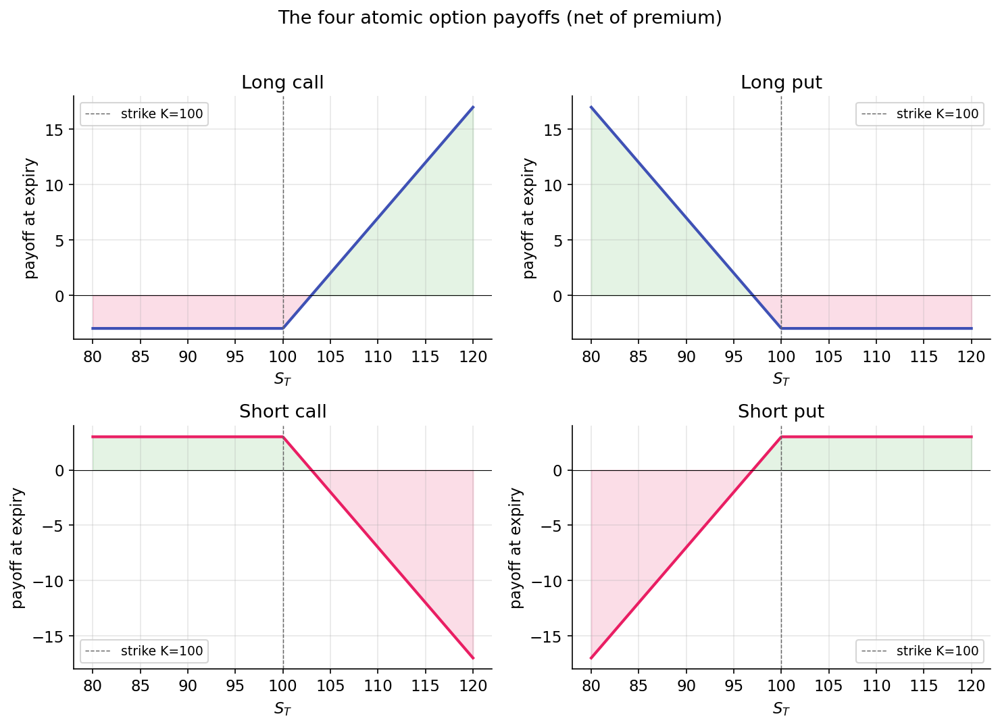

# The options contract

The options contract precedes the Greeks and Black-Scholes. It is a legal instrument whose structure determines the properties examined in the rest of this curriculum.

## Definition

An **option** is a contract granting its *holder* the right — but not the obligation — to buy or sell a specific asset at a specific price by a specific date.

The contract has four components:

| Term | Meaning |
|------|---------|
| **Underlying** | The asset the contract references (a stock, ETF, index, or commodity). |
| **Strike** $K$ | The agreed transaction price. |
| **Expiry** $T$ | The date the right lapses. |
| **Premium** | The price the buyer pays the seller upfront for the contract. |

There are two types:

- A **call option** conveys the right to buy the underlying at $K$.
- A **put option** conveys the right to sell the underlying at $K$.

Each contract has two sides: the **holder** (who paid the premium and owns the right) and the **writer** (who received the premium and assumes the obligation). This asymmetry — the holder can decline to exercise, the writer cannot — is the essential structural feature of options.

## Consequences of the asymmetric right

A holder who owns the right to buy at $K = \$100$ will:

- Exercise if the underlying is above $\$100$ at expiry (buying at $\$100$ and selling at the market price captures the spread).
- Decline to exercise if the underlying is below $\$100$ (there is no reason to buy at $\$100$ what the market offers at a lower price).

The holder's worst case at expiry is failing to exercise and forfeiting the premium previously paid. The holder's loss is bounded by the premium. The writer faces the mirror case: their best outcome is that the holder does not exercise, in which case the premium is retained. If exercise does occur, the writer's potential loss is unbounded.

A consequence of this asymmetry is that **options always have non-negative value**: the right to take an action plus the right to decline is worth at least zero. A deep-OTM contract near expiry might trade for a few cents but cannot trade at a negative price — one cannot pay another party to accept a right.

## Payoff at expiry

At expiry, time value, implied volatility, and hedging considerations are no longer relevant. The payoff is determined mechanically.

**Long call** on an underlying trading at $S_T$, struck at $K$:

$$
\text{Payoff}_\text{call} = \max(S_T - K, 0).
$$

If $S_T > K$, the holder exercises and realizes $S_T - K$. If $S_T \le K$, the holder does not exercise and the payoff is zero. Net P&L subtracts the premium paid.

**Long put:**

$$
\text{Payoff}_\text{put} = \max(K - S_T, 0).
$$

The symmetric case: if $S_T < K$, the holder exercises and realizes $K - S_T$. Otherwise the payoff is zero.

**Short call** (written rather than purchased):

$$
\text{Payoff}_\text{short call} = -\max(S_T - K, 0).
$$

The loss is unbounded if the underlying rises. Naked short calls are among the highest-risk positions in standard options trading.

**Short put:**

$$
\text{Payoff}_\text{short put} = -\max(K - S_T, 0).
$$

The loss is bounded by $K$ (a stock can reach zero but not go negative), but can be substantial. Writing puts is economically equivalent to agreeing to buy the stock at $K$ regardless of how far the price has fallen.

Plotted with payoff on the y-axis and $S_T$ on the x-axis, these produce the characteristic "hockey stick" shapes:

{ loading=lazy }

The geometry of more complex positions (spreads, straddles, butterflies) consists of sums and differences of these four shapes. The next lesson covers composite structures.

## Intrinsic value and time value

Before expiry, an option trades at some premium $P$. That premium decomposes into two components:

$$
P = \underbrace{\max(S_t - K, 0)}_{\text{intrinsic}} + \underbrace{P - \text{intrinsic}}_{\text{time value}} \qquad \text{(for a call).}
$$

**Intrinsic value** is the payoff from immediate exercise (ignoring the premium paid). Intrinsic value is positive for ITM options and zero for OTM or ATM options.

**Time value** captures everything else. It reflects the possibility that the underlying may move favorably between now and expiry — the value of the remaining optionality. Time value is largest for ATM options (where the next move has the greatest impact on payoff) and decays to zero at expiry, with the fastest decay in the final days. This decay is **theta**, covered in Part 3.

A call that is $10$% ITM with a month to expiry may trade at a premium of $\$11$ when its intrinsic value is $\$10$: $\$10$ intrinsic plus $\$1$ time value. Held to expiry with the underlying unchanged, the time value collapses to zero and the option trades at $\$10$ of pure intrinsic value.

## Moneyness and leverage

"Moneyness" describes the position of the strike relative to the underlying:

- **ITM** (in the money): a call with $S > K$ or a put with $S < K$. Intrinsic value is positive.
- **ATM** (at the money): $S \approx K$. Maximum time value, maximum gamma (Part 3).
- **OTM** (out of the money): a call with $S < K$ or a put with $S > K$. Intrinsic value is zero; the entire premium is time value.

OTM options trade at lower premiums because their payoff requires a meaningful move. A $\$2$ OTM call on a $\$100$ stock requires an approximately 10% move to finish ITM at expiry. If the move occurs, the position may appreciate substantially; if not, the $\$2$ premium is forfeited entirely. OTM options carry high leverage and a high probability of total loss. This asymmetry attracts speculative demand and makes systematic OTM writing profitable on average but subject to occasional large losses — the variance-risk-premium pattern covered in [Part 4](../vol-surface/implied-vol.md).

## American versus European, cash versus physical

Two structural features vary across options markets:

- **American options** permit exercise at any time before expiry. Single-name U.S. equity options (AAPL, TSLA) are American.
- **European options** permit exercise only at expiry. Cash-settled index options (SPX) are European.

European options are simpler to price: Black-Scholes yields a closed-form solution. American options introduce the optimal-exercise problem — determining when to exercise before expiry. For calls on non-dividend-paying stocks, early exercise is never optimal (exercising forfeits time value without compensating benefit). For puts and for calls on dividend-paying stocks, early exercise is occasionally optimal. The resulting pricing difference (American ≥ European at matched strike and expiry) is typically small in practice.

**Settlement** determines whether the underlying is physically delivered or the economic value is exchanged in cash. Single-name equity options settle physically; exercise results in share delivery. Index options are cash-settled; there is no physical delivery of constituent stocks. Settlement type is typically secondary for pricing and hedging, but becomes relevant around ex-dividend dates and corporate actions.

## Summary

Options pricing reduces to the following question: given the underlying's price, volatility, time to expiry, and risk-free rate, what premium is consistent with the payoff at expiry? The payoffs above define the terminal condition the model must satisfy. The remainder of Part 2 constructs a consistent present price:

- [Payoffs and put-call parity](payoffs-and-parity.md) — the no-arbitrage equation linking calls, puts, stock, and cash. Model-free.
- [Black-Scholes as a bridge](black-scholes.md) — a closed-form premium under the GBM assumption from Part 1.

The reader can now reason about:

- Why every option has non-negative premium: the right to act plus the right to decline is worth at least zero.
- Why deeper-OTM options trade at lower absolute premiums while offering higher leverage to the moves that would make them ITM — and why this structure makes them likely to expire worthless.
- The distinction between intrinsic and time value, and why time value concentrates near ATM and collapses fastest near expiry.

## Implemented at

The trading project does not price options from scratch; it consumes quoted premiums and uses them to compute Greeks via `trading/packages/gex/src/gex/greeks.py`. The contract mechanics above describe what those quotes represent. Subsequent lessons trace the full pipeline from quoted premium to implied volatility, to Greeks, to dealer positioning.

---

**Next:** [Payoffs and put-call parity →](payoffs-and-parity.md)
