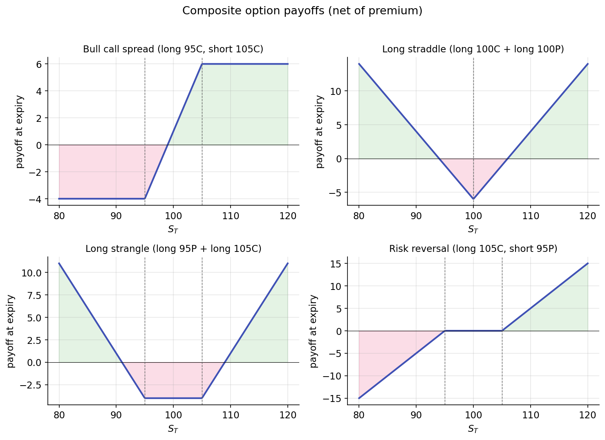

# Payoffs and put-call parity

Four atomic payoffs (long call, long put, short call, short put) compose into every structure on the options chain. Most complex-looking options positions are sums and differences of these four hockey-stick shapes.

One equation — put-call parity — relates the prices of calls, puts, the underlying, and cash. It holds regardless of the pricing model; any violation implies an arbitrage opportunity.

## Composing payoff diagrams

The four single-leg payoffs from [the previous lesson](contracts.md), at expiry as a function of terminal price $S_T$:

- Long call: $\max(S_T - K, 0) - c$ (subtract premium paid)
- Long put: $\max(K - S_T, 0) - p$
- Short call: $c - \max(S_T - K, 0)$
- Short put: $p - \max(K - S_T, 0)$

Every combination payoff is a linear sum of these four shapes. Graphical addition of payoff diagrams is typically the fastest way to characterize a position.

### Bull call spread (long $K_1$ call + short $K_2$ call, $K_1 < K_2$)

$$
\text{Payoff} = \max(S_T - K_1, 0) - \max(S_T - K_2, 0).
$$

Evaluating piecewise:

| $S_T$ region | Payoff |
|--------------|--------|
| $S_T \le K_1$ | $0$ |
| $K_1 < S_T < K_2$ | $S_T - K_1$ |
| $S_T \ge K_2$ | $K_2 - K_1$ |

The bull call spread is a bullish position with capped upside. Maximum profit is $K_2 - K_1$ minus net premium paid, reached when $S_T \ge K_2$. Maximum loss is the net premium. The structure exchanges unlimited upside for a lower entry cost than a naked long call.

### Long straddle (long $K$ call + long $K$ put)

$$
\text{Payoff} = \max(S_T - K, 0) + \max(K - S_T, 0) = |S_T - K|.
$$

A V-shape centered at $K$. The position is profitable when $|S_T - K|$ exceeds the combined premium paid. Long straddles are long-volatility positions: direction is irrelevant, provided the move is large enough. The position expresses a bet on convexity.

### Long strangle (long $K_1$ put + long $K_2$ call, $K_1 < K_2$)

Similar to a straddle but with wider strikes. Lower premium (both legs are OTM when $S_0 \in (K_1, K_2)$), at the cost of requiring a larger move to become profitable. The structure trades reduced sensitivity to small moves for a wider region of zero payoff around the current price.

### Risk reversal (long $K_\text{high}$ call + short $K_\text{low}$ put)

A payoff sloping upward across the entire price range — effectively synthetic long exposure with a flat region in the middle. Risk reversals express directional views while monetizing skew: on equity indices, call premium at a given delta is typically lower than put premium at the equidistant delta (because [skew](../vol-surface/skew.md) makes OTM puts expensive), so a long call / short put risk reversal often has near-zero net premium. The equivalent stock position has similar expected P&L but requires more capital.

All four together:

{ loading=lazy }

These are a starting set. Butterflies, iron condors, calendar spreads, diagonals — all compose from the same four atoms. If you can graph long call and short call, you can graph anything.

## Put-call parity — the model-free equation

The prices of a call and a put struck at the same $K$ and expiring at the same $T$ are not free parameters. They are linked to the underlying's price and to the cost of cash:

$$
C - P = S - K e^{-rT}.
$$

Here $C$ is the call price, $P$ the put price, $S$ the current underlying price, $r$ the risk-free rate, and $T$ the time to expiry. $K e^{-rT}$ is the present value of the strike — cash discounted at the risk-free rate.

Two points before the derivation:

1. This identity is not Black-Scholes. It does not assume GBM, log-normality, constant volatility, or any particular process for $S$. It assumes only that arbitrage opportunities are eliminated by market participants.
2. It holds for European options. American options can deviate slightly due to early exercise, but the deviation is typically small for non-dividend-paying stocks.

### Derivation by no-arbitrage

Consider two portfolios at time $t = 0$:

- **Portfolio A:** long one call plus short one put, both at strike $K$ and expiry $T$. Net price today: $C - P$.
- **Portfolio B:** long one unit of the underlying plus short $K e^{-rT}$ dollars of cash (borrow $K e^{-rT}$ at rate $r$, repay $K$ at $T$). Net price today: $S - K e^{-rT}$.

At expiry:

**Portfolio A at $T$:** The call pays $\max(S_T - K, 0)$; the short put pays $-\max(K - S_T, 0)$. Their sum is:

| $S_T$ region | Call pays | Short put pays | Sum |
|--------------|-----------|----------------|-----|
| $S_T > K$ | $S_T - K$ | $0$ | $S_T - K$ |
| $S_T < K$ | $0$ | $-(K - S_T) = S_T - K$ | $S_T - K$ |
| $S_T = K$ | $0$ | $0$ | $0 = S_T - K$ |

Portfolio A pays exactly $S_T - K$ at expiry for every value of $S_T$.

**Portfolio B at $T$:** The underlying is worth $S_T$; the borrowed cash is repaid at $K$. The net is $S_T - K$.

Both portfolios pay the same amount in every terminal state. If they paid the same in every state and had different prices today, shorting the more expensive and buying the cheaper would lock in a riskless profit. No-arbitrage therefore requires:

$$
C - P = S - K e^{-rT}.
$$

The derivation uses no distributional assumption, no hedging argument, and no stochastic calculus. Two portfolios with identical payoffs must have identical prices.

## What parity gives you

### Synthetic positions

Rearranging parity allows synthesizing any one of the four instruments from the other three:

$$
\text{Long stock} = C - P + K e^{-rT}.
$$

A long call plus short put plus $K e^{-rT}$ in cash provides the same economic exposure as a long stock position, with matching P&L in every state. Institutional desks use this construction to replicate stock exposure through options when capital efficiency or margin rules favor it.

Similarly:

$$
C = P + S - K e^{-rT}, \qquad P = C - S + K e^{-rT}.
$$

A call is synthetically replicated by a put plus stock minus cash; a put is replicated analogously. Given only call quotes, the put prices are determined.

### Parity as a data-integrity check

Parity violations in real data typically indicate one of three conditions:

1. Data errors (stale prices, one side from market close, the other from last trade).
2. Frictions not represented in the equation (hard-to-borrow fees on short stock, early-exercise premium on American options, unaccounted dividends).
3. Genuine arbitrage — rare, short-lived, and typically eliminated quickly by market makers.

In practice, the parity equation catches more data errors than arbitrage opportunities. It serves as both a sanity check and a debugging tool.

### Dividends

If the underlying pays dividends with total present value $D_0 = \sum_i d_i e^{-r t_i}$ before expiry, parity becomes:

$$
C - P = S - D_0 - K e^{-rT}.
$$

The long-stock portfolio collects dividends over the contract's life; the synthetic long (calls minus puts) does not. Subtracting the present value of dividends corrects for this flow.

## Summary

The reader can now reason about:

- How options positions decompose into sums of single-leg payoffs and how to characterize any strategy diagram by inspection.
- How to synthesize a long stock position from a call, a put, and cash, and why institutional desks sometimes prefer the synthetic.
- The model-free status of put-call parity and its role as a sanity check on options datasets.

## Implemented at

Put-call parity is not an algorithm in the trading project; it is an invariant. Given a chain from `trading/packages/gex/src/gex/data/options.py` (the `YFinanceChainSource` or `PolygonChainSource`), computing $C - P - S + K e^{-rT}$ for each strike should yield values near zero. Deviations indicate data issues rather than signals. This check is a reasonable first step in debugging the GEX pipeline.

---

**Next:** [Black-Scholes as a bridge →](black-scholes.md)
