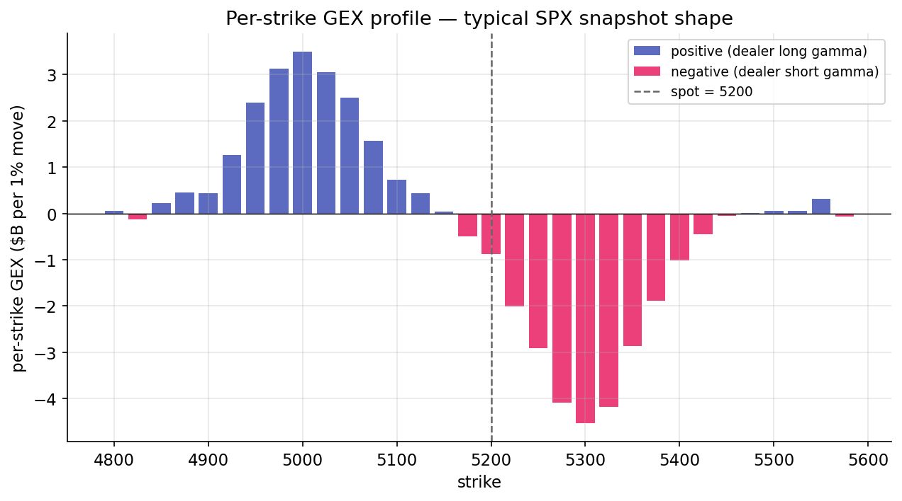

# Dealer gamma — long vs short

The market-makers lesson established the mechanism of dealer hedging. This lesson quantifies the magnitude. Aggregating gamma across every outstanding option, signed by dealer position, produces a single number summarizing the market's hedging regime — gamma exposure (GEX).

## Aggregation formula

For a single contract at strike $K$ with open interest $\text{OI}_K$ and implied volatility $\sigma_K$, the dealer's gamma position is:

$$
G_K = \text{sign}_K \cdot \Gamma_K \cdot \text{OI}_K \cdot \text{multiplier}
$$

where:

- $\Gamma_K$ is the Black-Scholes gamma per share, computed from $S$, $K$, $\sigma_K$, $T$, $r$ (from [Lesson 8](../greeks/gamma.md)).
- $\text{OI}_K$ is open interest — the number of contracts outstanding at that strike.
- $\text{multiplier}$ is the contract size (100 for standard U.S. equity options).
- $\text{sign}_K$ is the dealer-position sign under the "dealers short customer-preferred flow" assumption: $-1$ for calls, $+1$ for puts.

$G_K$ has units of shares per dollar of spot move. Conversion to dollar hedging flow per 1% move:

$$
\text{GEX}_K = G_K \cdot S^2 \cdot 0.01.
$$

The two factors of $S$ arise as follows. $\Gamma$ has units of shares-per-dollar; multiplying by $S$ converts to dollars-of-hedge-per-dollar-move. Multiplying by $S$ again converts a 1% move from dollars to a fraction of spot ($0.01 \cdot S$), and gamma times the square of that move introduces a second $S$ factor. The final $0.01$ is the 1% scaling.

## Summation across the chain

Total GEX across all strikes and both option types:

$$
\text{Total GEX} = \sum_K \left( \text{GEX}_K^{(\text{call})} + \text{GEX}_K^{(\text{put})} \right).
$$

For SPX in a non-stressed regime, this sum is typically positive (dealers net long gamma), in the range of tens of billions of dollars per 1%. During stressed regimes, it becomes negative — dealers net short gamma at similar magnitudes. These are the two regime extremes the classifier identifies.

The "dollars per 1% move" unit is central to interpretation. It states: if SPX moves 1%, aggregate dealer hedging flow is $X dollars of stock, in the direction of the move (when short gamma) or against the move (when long gamma). The quantity has an intuitive dimension comparable to daily trading volume and individual market-maker capacity.

## Per-strike structure

The total sum is a single scalar. The distribution across strikes reveals additional structure. A typical SPX chain snapshot has the following shape:

{ loading=lazy }

Dealers' long-put exposure concentrates in OTM puts (strikes well below spot), contributing positive per-strike GEX. Short-call exposure concentrates in OTM calls (strikes well above spot), contributing negative per-strike GEX. Near-the-money contributions depend on the day's OI and are typically smaller than the wings.

The shape has implications for cumulative aggregation. Walking strikes from low to high, the running cumulative sum starts positive (accumulating OTM put contributions), grows toward a peak near the money, and then falls as OTM call contributions accumulate negative. The point at which the cumulative sum crosses zero is the [gamma-flip strike](gamma-flip.md), the subject of the next lesson.

## Long-gamma regime

When total GEX is strongly positive, dealers are net long gamma. As shown in [Lesson 8](../greeks/gamma.md), long-gamma hedging captures positive-convexity scalps paid for with theta. Dealer hedging is mean-reverting — selling strength, buying weakness.

Long-gamma regimes exhibit:

- Low realized volatility, as hedging flow dampens moves.
- Mean reversion, with prices tending to return to a range. Pinning near large strikes around expiration is a characteristic long-gamma phenomenon.
- Favorable conditions for short-volatility strategies. When realized volatility is below implied (as is common in long-gamma regimes), short-vol positions harvest the premium without material drawdowns.

These regimes correspond to extended quiet periods. They persist while the dealer-gamma aggregate remains positive.

## Short-gamma regime

When total GEX is strongly negative, dealers are net short gamma. Hedging amplifies trends — buying strength, selling weakness.

Short-gamma regimes exhibit:

- Higher realized volatility, as hedging flow amplifies moves.
- Trend persistence: moves in one direction attract further hedging in the same direction. Gamma squeezes are the extreme case.
- Short-volatility drawdowns. When realized volatility exceeds implied (common in short-gamma regimes), short-vol positions incur losses. Volmageddon 2018 and COVID 2020 were short-gamma events.

The regime classifier sets the `short_gamma` tag when total GEX is negative, among other triggers. The tag indicates that the hedging environment amplifies rather than dampens; it does not imply that every day is chaotic.

## Time-to-expiry dimension

Gamma is largest for short-dated options and falls for long-dated ones due to the $1/\sqrt{T}$ factor. As a result, short-dated open interest dominates total GEX. A weekly 0DTE contract contributes substantially more gamma per unit of OI than a monthly, which in turn contributes more than a LEAPS. When 0DTE options are near the money, they can drive the aggregate. 0DTE contracts have grown to half or more of SPX options volume as of the mid-2020s, changing the dynamics of the GEX surface: gamma is increasingly concentrated in ultra-short-dated contracts that expire by end of day, producing an intraday-sensitive picture.

Most GEX calculations, including this project's, aggregate across all tenors without distinction. A more refined model would bucket by expiry window (weekly, monthly, quarterly) and track each bucket's hedging flow separately. For first-pass regime classification, the unified aggregate is sufficient.

## SPY versus SPX

Although SPY and SPX both track the S&P 500, their options markets have different open-interest profiles. SPX options are European and cash-settled, used heavily by institutional hedgers and risk managers. SPY options are American and physically settled, used more often by retail and tactical traders.

The two chains' GEX profiles can diverge meaningfully. SPX GEX is typically cleaner and more stable; SPY GEX oscillates more with retail flow. Research discussions of dealer gamma regimes typically reference SPX. Live trading against SPY encounters noisier per-strike GEX oscillations — the cumulative-crossing definition of the flip strike in the next lesson was adopted specifically to handle this noise.

## Summary

The reader can now reason about:

- Why GEX is reported in "dollars per 1% move" rather than raw shares per dollar — the $S^2 \cdot 0.01$ conversion produces a quantity with intuitive economic dimension.
- Why the sign of total GEX partitions market behavior into two regimes: long gamma (dampening, mean-reverting, low realized volatility) and short gamma (amplifying, trending, high realized volatility).
- How the growth of 0DTE contracts has reshaped the GEX surface, concentrating gamma in contracts that expire the same day.

## Implemented at

`trading/packages/gex/src/gex/gex.py`:

- Line 22: `per_strike_gex(chain, spot, rate)` computes signed contributions per strike. The central line is 53:
  ```python
  signs = np.where(opt == "C", -1.0, 1.0)
  contribution = signs * oi * gammas * CONTRACT_MULTIPLIER * (spot**2) * PERCENT_MOVE
  ```
- Line 64: `total_gex(per_strike)` sums across all strikes to produce the regime scalar.

`classify_regime` treats `total_gex < 0` as one of its short-gamma triggers, alongside spot-below-flip and a crushed skew z-score.

---

**Next:** [The gamma flip strike →](gamma-flip.md)
