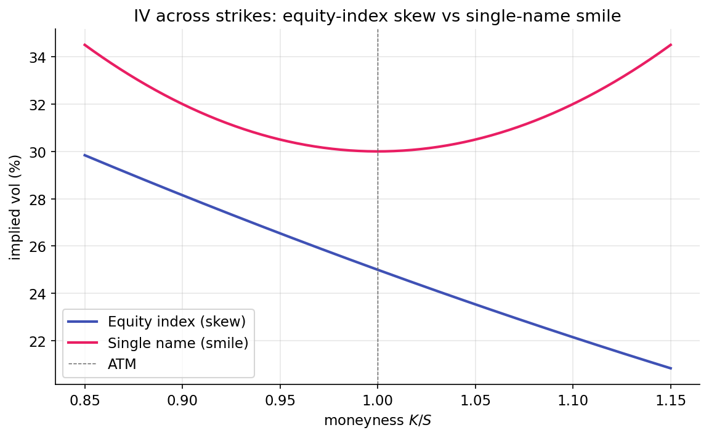

# Skew and the smile

Term structure describes how IV varies across expiries. Skew describes how IV varies across strikes at a single expiry. Black-Scholes assumes a single $\sigma$ prices every strike; observed market prices depart from that assumption, and the shape of the departure carries information.

## Characteristic shapes

Plot ATM IV, OTM put IVs, and OTM call IVs for SPX and for a single name at a matched 30-day expiry. Two characteristic shapes appear:

{ loading=lazy }

For the equity index, OTM puts trade at higher IV than ATM, and ATM trades at higher IV than OTM calls. The curve slopes downward in strike — the classic equity-index skew. Single-name equities often show a different shape, with IV elevated on both wings, producing a smile.

Both shapes have structural origins. Index skew reflects persistent demand for downside protection from hedgers. Smile arises in single names because large surprise moves can occur in either direction (earnings releases, M&A activity), and the tails on both sides carry similar insurance premiums.

## Historical origin

Before October 1987, the IV surface was approximately flat across strikes. After the crash, this changed. Participants concluded that large downside moves occurred more frequently than Black-Scholes (log-normal tails) predicted, and demand for OTM put protection rose. That demand has not fully subsided. Dealers now quote OTM puts at a premium that reflects the persistent hedging bid and the perceived fat left tail. Every equity index has carried skew since.

The asymmetry has a second cause: the **leverage effect**. When stocks fall, implied leverage rises (same debt over smaller equity), increasing equity risk. Realized volatility tends to rise on large down moves and fall on large up moves. Models that capture this — stochastic volatility with negative return-volatility correlation — naturally produce a skewed implied-volatility surface.

## The 25-delta skew measure

Many measures quantify skew. The most common in practice, and the one this project uses:

$$
\text{skew}_{25\Delta} = \text{IV}(25\Delta \text{ put}) - \text{IV}(25\Delta \text{ call}).
$$

A 25-delta put is an OTM put with delta $-0.25$ (approximately 75% likely to finish OTM, per the delta-as-probability interpretation from [Lesson 7](../greeks/delta.md)). A 25-delta call is the corresponding OTM call with delta $+0.25$. The skew is the spread between their IVs.

For a typical equity index in calm markets, this spread is in the 2–4 vol-point range. In stressed conditions, it can widen to 6–10 points. In euphoric regimes where short-volatility strategies are complacent, it can compress toward zero. A flat skew often precedes volatility events, because compression indicates the market has stopped paying for downside protection.

The 25-delta convention is a compromise: far enough OTM to lie in the insurance region of the distribution, but close enough that liquidity supports reliable IV quotes. 10-delta and 50-delta alternatives exist; 25-delta is the most common convention.

## Delta-space interpolation

Option chains do not quote strikes at fixed delta values — they quote at fixed prices (for example, 400, 405, 410). Computing IV at exactly 25-delta requires interpolation. The standard method: map each quoted strike to its delta (using Black-Scholes with the strike's own IV), then interpolate IV across the delta axis.

Working in delta-space rather than strike-space is intentional. Delta is a natural reparameterization of the surface: the 25-delta point on SPX moves with $S$, so the skew measure remains in the same part of the risk distribution regardless of where spot sits today. Strike-based measures (for example, "IV at $S \times 0.9$") conflate spot moves with skew moves.

The implementation in `skew.py` walks the chain, computes each contract's delta from its strike and IV (via `bs_d1` and the cumulative normal), and linearly interpolates IV at the target delta. Linear interpolation is adequate for normally-shaped surfaces; for more accurate tail-shape fits, SABR or SVI parameterizations are standard alternatives. The repo notes this as a future upgrade.

## Skew z-score as a regime input

Like term structure, raw skew levels matter less than their position relative to their own history. A rolling z-score captures this:

$$
z_\text{skew}(t) = \frac{\text{skew}_{25\Delta}(t) - \overline{\text{skew}}_\text{252d}}{\sigma_\text{skew, 252d}}.
$$

Three regions of $z_\text{skew}$ are informative:

- **Highly positive $z$**: skew is historically steep. Puts are expensive relative to history. This indicates either priced-in stress or aggressive hedging ahead of an anticipated event.
- **Near-zero $z$**: skew is at its historical norm. No signal on this axis.
- **Highly negative $z$**: skew is flattening or inverting. Put protection is unusually cheap relative to history. This condition often precedes volatility events, either because hedgers have stopped paying for protection (complacency) or because active selling of skew is compressing the spread.

The regime classifier uses a negative threshold on $z_\text{skew}$: when the z-score is deeply negative (default threshold $-2.0$), the condition triggers a short-gamma regime tag. This reflects the empirical association between flat or inverting skew and subsequent volatility events.

## When skew fails as a signal

Not every skew movement is informative. Two recurring cases:

- **Earnings season for single names**: pre-earnings skew shifts reflect the upcoming event rather than a structural regime change. Index skew is less affected because index ATM IV absorbs earnings effects diffusely across constituents.
- **Dealer inventory rebalancing**: large customer orders can move individual strike IVs without signaling anything about market risk tolerance. Dealer positions and hedging needs drive quoted prices; not every movement is a macro signal.

The regime classifier mitigates the first case by using index-level (SPX) skew, where idiosyncratic effects are diluted. At the single-name level, skew is a noisier standalone signal.

## Smile versus skew — parameterizing the surface

For a complete treatment, practitioners fit parametric models to the IV surface across strikes and expiries. Two standard families:

- **SVI** (Stochastic Volatility Inspired): five parameters per expiry, fit to strike-IV pairs. Fast and common in risk systems.
- **SABR**: four parameters including a $\beta$ that controls whether the surface is skew-like or smile-like. Common in FX and interest-rate volatility surfaces.

The regime classifier in this project does not require a parametric fit: the 25-delta skew is a scalar summary that captures sufficient surface asymmetry. Future strategies requiring finer-grained surface information (trading the butterfly, hedging across specific strike buckets) could extend to SVI or SABR.

## Summary

The reader can now reason about:

- Why the equity-index IV surface slopes downward in strike (skew) while single-name surfaces often form a smile — the two reflect different customer flow patterns and different structural risk profiles.
- Why skew is typically measured in delta-space rather than strike-space — delta moves with spot, producing a measure invariant to the current market level.
- Why flattening of skew, rather than steepening, often precedes volatility events: flattening reflects complacency about downside risk.

## Implemented at

`trading/packages/gex/src/gex/skew.py`:

- Line 26: `interpolate_iv_at_delta(chain, target_delta, option_type, spot, rate)` filters to the shortest expiry with ≥21 DTE (excluding weekly noise), maps each contract to its delta, and linearly interpolates IV at the target delta.
- Line 64: `skew_25d(chain, spot, rate)` computes the scalar `IV(25d put) - IV(25d call)`.

The regime classifier in `regime.py:classify_regime` consumes `skew_25d_z` (the rolling z-score of daily skew) and triggers the short-gamma regime when z ≤ -2.0.

---

**Next:** [Market makers and delta-hedging →](../regime/market-makers.md)
