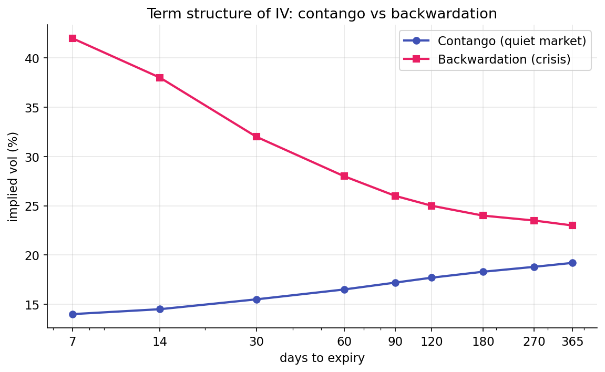

# Term structure of volatility

A single implied-volatility number is insufficient: no single $\sigma$ prices the entire options chain, because options at different expiries trade at different IVs. The pattern of IV across expiries is the **term structure**, and its slope is one of the most reliable regime signals available in options markets.

## Plotting the curve

Pull ATM IVs across expiries (1 week, 2 weeks, 1 month, 3 months, 6 months, 1 year) on the S&P 500. In quiet markets, the curve is upward-sloping (contango, shown in blue). In crises, the short end spikes above the long end (backwardation, shown in pink):

{ loading=lazy }

**Contango** is the normal state: longer horizons price higher uncertainty, and the variance risk premium is typically larger in absolute terms over longer expiries. **Backwardation** is a crisis marker: short-term uncertainty becomes high enough that near-dated options trade at higher IV than far-dated ones, because longer horizons carry an implicit belief in mean reversion and thus do not track the short-term spike.

Slope transitions are rapid; mean reversion of the slope is slow.

## The VIX family

CBOE publishes IV indices at specific maturities on the S&P 500:

| Index | Horizon |
|-------|---------|
| VIX9D | 9 days |
| VIX | 30 days |
| VIX3M | 3 months |
| VIX6M | 6 months |

Each uses the model-free variance-swap formula from [the previous lesson](implied-vol.md), scaled to its target horizon. The two most-watched ratios are:

- $\text{VIX9D} / \text{VIX}$ — short-end slope. A ratio above 1 indicates intraday panic pricing above 30-day IV, producing a fast signal of short-horizon stress.
- $\text{VIX} / \text{VIX3M}$ — medium slope. A ratio above 1 means 30-day IV exceeds 3-month IV; this is the most commonly referenced backwardation indicator.

In contango, both ratios are below 1. Inversion pushes one or both above 1.

## Inversion as a regime signal

Empirically, inverted term structure correlates with:

- Short-gamma dealer positioning (Part 5) — the hedging feedback loop that amplifies moves.
- Higher realized volatility in the following days.
- Lower mean-reversion — trends that would normally reverse show more follow-through.

The underlying mechanism: demand for short-dated protection (puts expiring this week) is most elastic during acute stress. Customers buy puts; dealers sell them; the implied vol on those puts rises sharply, inverting the short end. The long end moves less (buyers do not panic-hedge year-out exposure), and the slope flips. Inversion is the observable footprint of panic hedging flow.

The signal is noisy. VIX/VIX3M occasionally crosses 1.0 on minor market blips and reverts within hours; in other periods, it crosses and stays above 1.0 for weeks. The persistence of the inversion matters as much as its presence.

## Thresholds and noise tolerance

Raw threshold at exactly 1.0 is noisy — small rounding errors, stale data, intraday feeds that don't sync perfectly can push a ratio fractionally above 1.0 without meaningful regime change. A small buffer helps:

$$
\text{is\_inverted} \;=\; \text{short\_slope} > 1.02 \;\; \text{or} \;\; \text{med\_slope} > 1.02.
$$

The 1.02 threshold provides a 2% cushion to avoid flip-flopping around the 1.0 boundary. This value is a calibration choice, not a theoretical constant. A cleaner data source might permit 1.01; a noisier one might require 1.03. The threshold must be above unity by enough to ignore measurement error and below the levels that characterize real stress (empirically above 1.05 during material events).

## Rolling z-scores

Absolute slope levels are not the only useful signal. "The short end is inverted" is one observation; "the short end inverted for the first time in six months" is a different, often sharper, signal. A rolling z-score captures the second form:

$$
z_t = \frac{\text{slope}_t - \bar{\text{slope}}_\text{252d}}{\sigma_\text{slope, 252d}}.
$$

A large positive $z$ indicates the slope is unusually high relative to its trailing year, which can flag regime shifts before the raw threshold is crossed. The trading project computes these alongside the raw ratios.

## Term structure versus VIX level

A common conflation treats "VIX is high" and "VIX term structure is inverted" as equivalent signals. They are not:

- VIX high, contango: elevated volatility the market expects to persist or grow. Still ordered.
- VIX high, inverted: acute short-term stress the market expects to mean-revert. The shape carries information distinct from the level.

Both observations matter in practice. The regime classifier uses shape (inversion) as a trigger for the `vol_inverted` regime; level is not an explicit trigger but indirectly affects position sizing in any strategy that scales by vol.

## The full surface

Term structure is one axis of the implied-volatility surface. The other is strike — IV also varies across strikes at a single expiry. That axis is [skew](skew.md), covered in the next lesson. Both are departures from the Black-Scholes constant-$\sigma$ assumption, and both are tradable. Dispersion trading, calendar spreads, skew trades, and volatility-carry strategies are expressions of one of these two shapes.

The trading project consumes two summary statistics from term structure: the two slopes and their inversion flag. The full surface contains additional information, but the regime classifier is intentionally simple, using one scalar from term structure, one from skew, and one from dealer gamma.

## Summary

The reader can now reason about:

- Why a single "IV" number conceals surface structure, and why slope across expiries can carry the signal when the level does not.
- What contango and backwardation mean in volatility terms, and why backwardation correlates with short-gamma and high-realized-volatility regimes.
- Why thresholds such as 1.02 appear in regime rules instead of 1.0: noise tolerance is a calibration decision, not a theoretical boundary.

## Implemented at

`trading/packages/gex/src/gex/termstructure.py`:

- Line 23: `compute_term_structure(vix9d, vix, vix3m)` returns the two slopes and the inversion flag for a single EOD snapshot.
- Line 39: `rolling_inversion_flags(series, lookback_days=252)` builds the same ratios across history plus the 252-day rolling z-scores. Output columns: `short_slope`, `med_slope`, `short_slope_z`, `med_slope_z`, `is_inverted`.

The `regime.py::classify_regime` function consumes these via the `short_slope` and `med_slope` arguments and uses a `1.02` inversion threshold to trigger the `vol_inverted` regime tag.

---

**Next:** [Skew and the smile →](skew.md)
